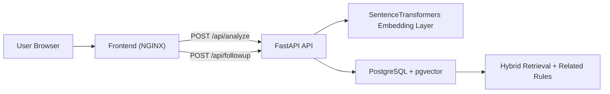

# Legal Situation Analyzer

Legal Situation Analyzer helps housing society members understand which Maharashtra Cooperative Housing Society Model Bye-law may apply to their situation.

The app uses a hybrid retrieval pipeline:

1. sentence-transformer embedding generation
2. `pgvector` semantic search in PostgreSQL
3. keyword and topic filtering
4. hybrid scoring
5. structured explanation with citation, example, conditions, related rules, and confidence score
6. optional follow-up questions based on the previous answer context

## Architecture



## Project structure

```text
legal-situation-analyzer/
├── .env.example
├── README.md
├── api/
│   ├── bylaw_seed.py
│   ├── database.py
│   ├── embeddings.py
│   ├── import_service.py
│   ├── main.py
│   ├── requirements.txt
│   ├── schemas.py
│   └── search.py
├── dataset/
│   └── bylaws_dataset.json
├── database/
│   └── init.sql
├── docker/
│   ├── Dockerfile.api
│   ├── Dockerfile.database
│   └── Dockerfile.frontend
├── frontend/
│   ├── index.html
│   ├── nginx.conf
│   ├── script.js
│   └── styles.css
├── kubernetes/
│   ├── api-deployment.yaml
│   ├── app-secret.yaml
│   ├── frontend-deployment.yaml
│   └── postgres-deployment.yaml
├── docker-compose.yml
└── import_bylaws.py
```

## Data model

### `bylaws`

- `section`
- `subsection`
- `title`
- `topic`
- `keywords`
- `content`
- `explanation`
- `example`
- `conditions_required`
- `possible_challenges`
- `related_statutes`
- `embedding`

### `bylaw_relations`

- `source_section`
- `source_subsection`
- `target_section`
- `target_subsection`

## API

### `POST /analyze`

Example request:

```json
{
  "description": "Our society used sinking fund for routine maintenance without a structural report or General Body approval."
}
```

Example response:

```json
{
  "law": "Maharashtra Cooperative Housing Society Model Bye-laws",
  "section": "14",
  "subsection": "c",
  "title": "Utilisation of Sinking Fund",
  "explanation": "Bye-law 14(c) is generally read as limiting the Sinking Fund to major structural repairs, heavy renewals, or reconstruction-related expenditure rather than ordinary recurring maintenance.",
  "citation": "Bye-law 14(c) deals with utilisation of sinking fund and expects the society to follow the registered bye-laws, the Act, and the proper society process on this subject.",
  "example": "Example: the society uses sinking fund for ordinary painting work. Members may question this if the fund should be reserved for major structural work.",
  "conditions_required": [
    {
      "requirement": "Registered bye-laws and legal process must be followed",
      "plain_explanation": "The society should act according to its registered bye-laws, the Co-operative Societies Act, and the Rules that apply."
    }
  ],
  "possible_challenges": [
    "Sinking Fund used for routine maintenance instead of major structural repairs or reconstruction"
  ],
  "related_statutes": [
    "Maharashtra Co-operative Societies Act, 1960"
  ],
  "related_rules": [
    {
      "section": "14",
      "subsection": "b",
      "title": "Utilisation of the Repairs and Maintenance Fund by the Society"
    }
  ],
  "confidence": 52,
  "disclaimer": "This information is based on model bye-laws and is for informational purposes only. Actual applicability depends on the registered bye-laws of the specific society."
}
```

### `POST /followup`

Example request:

```json
{
  "question": "Does this need approval from all members?",
  "context": {
    "...": "previous analyze response"
  }
}
```

The follow-up answer uses the previous response context instead of repeating semantic search.

## Dataset import

The bundled dataset is stored at [dataset/bylaws_dataset.json](</C:/Users/Vipul/Documents/New project/legal-situation-analyzer/dataset/bylaws_dataset.json>).

Import commands:

```bash
python import_bylaws.py
python import_bylaws.py --dataset dataset/bylaws_dataset.json --replace-existing
python import_bylaws.py --dataset custom_bylaws.csv --replace-existing
```

For CSV imports, `conditions_required` should use this format inside a cell:

```text
Requirement 1::Plain explanation 1|Requirement 2::Plain explanation 2
```

## Local run

```bash
docker compose up --build
```

If you are upgrading from an older local database volume:

```bash
docker compose down -v
docker compose up --build
```

Open [http://localhost:8080](http://localhost:8080).

## Kubernetes

```bash
kubectl apply -f kubernetes/app-secret.yaml
kubectl apply -f kubernetes/postgres-deployment.yaml
kubectl apply -f kubernetes/api-deployment.yaml
kubectl apply -f kubernetes/frontend-deployment.yaml
```

## Verification completed

The current version was verified with:

- `python -m compileall api import_bylaws.py`
- `docker compose config`
- `docker compose build`
- live `POST /api/analyze` checks for:
  - sinking fund misuse
  - parking allocation dispute
- live `POST /api/followup` check

## Disclaimer

Every response includes:

> This information is based on model bye-laws and is for informational purposes only. Actual applicability depends on the registered bye-laws of the specific society.
